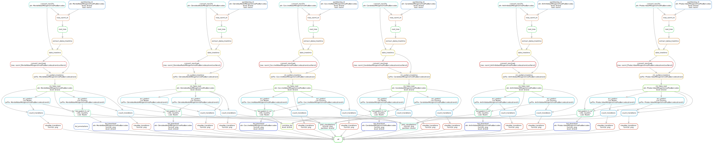

# Maximum likelihood (ML) analysis of coleoptera data

The project contains data and the pipeline for the ML analysis of coleoptera.

## Data

### Input data
The input data is expected to contain four files per family and one common metadata file: 
1. the alignment in nexus format called \<family>.nexus *(replace \<family> with appropriate name)* and placed in [data/alignments](data/alignments) folder. It should define gene positions for the partitioning, in the following form *(update the positions if needed)*:

```
BEGIN SETS;
	charset nad2 = 1-1023;
	charset cox1 = 1024-2562;
	charset cox2 = 2563-3255;
	charset atp8 = 3256-3423;
	charset atp6 = 3424-4098;
	charset cox3 = 4099-4887;
	charset nad3 = 4888-5247;
	charset nad5 = 5248-6966;
	charset nad4 = 6967-8304;
	charset nad4l = 8305-8589;
	charset nad6 = 8590-8949;
	charset cob = 8950-10095;
	charset nad1 = 10096-11046;
end;
```
2. the outer outgroup file called outgroup_\<family>.txt and placed in [data/alignments](data/alignments) folder. It should contain the ids of the outgroup to both the family of interest and the inner outgroup that defines the date (see below). Each id should be on a new line, e.g.:
```
MG193452
CCCP_P3_05
MG193334
```
3. the inner outgroup for which the split time with the family of interest is defined. 
It should be called outingroup_\<family>.txt and placed in [data/alignments](data/alignments) folder.
4. the age of the split between the family of interest and the inner outgroup (Ma). 
It should be called age_\<family>.txt and placed in the [data/timetrees](data/timetrees) folder. It should contain the age, e.g.:
```
140.8
```
5. the metadata is stored in tab-delimited format (for all the families) as [data/metadata.tab](data/metadata.tab).

### Output data
The analysis pipeline reconstructs a phylogeny for each of the input alignments ([data/trees](data/trees)), 
dates it ([data/timetrees](data/timetrees)), performs phylogeographic analysis ([data/acr](data/acr)), and produces figures ([data/figs](data/figs)).

## Analysis pipeline
The snakemake [[Köster *et al.*, 2012](https://doi.org/10.1093/bioinformatics/bts480)] analysis pipeline 
can be found in the [snakemake](snakemake) folder. It uses ad-hoc python scripts from the [py](py) folder.

To run it, first install [Singularity](https://sylabs.io/docs/#singularity), then install snakemake:
```
pip3 install snakemake
```
Then edit [snakemake/Snakefile_analysis](snakemake/Snakefile_analysis) file to specify the family of interest.

Finally run:
```bash
snakemake --snakefile Snakefile_analysis --keep-going --config folder=.. --use-singularity -singularity-args "--home ~"
```


The analysis steps are detailed below:

### 1. Tree reconstruction
We reconstruct an ML tree from the DNA sequences using partitioning into four groups: 
positions 1-2 vs 3 on the forward vs reverse strands. 
The genes nad2, cox1, cox2, atp8, atp6, cox3, nad3, nad6, and cob are located on the forward strand, 
while nad1, nad4, nad4l, and nad5 are on the reverse one.
The tree reconstruction is performed with RAxML-NG (GTR+GAMMA+G6+I model) [[Kozlov *et al.*, 2019](https://academic.oup.com/bioinformatics/advance-article/doi/10.1093/bioinformatics/btz305/5487384)].

### 2. Tree rooting and dating
The trees reconstructed at the previous step, 
are then rooted with an outgroup and dated with TreeTime [[Sagulenko *et al.*, 2018](https://www.ncbi.nlm.nih.gov/pmc/articles/PMC5758920/)] 
(auto-correlated clock). 

### 3. Phylogeography
We perform a phylogeographic analysis on the dated trees 
via ancestral character reconstruction (ACR) for Country and Realm 
using PastML [[Ishikawa *et al.*, 2019](https://doi.org/10.1093/molbev/msz131)].
